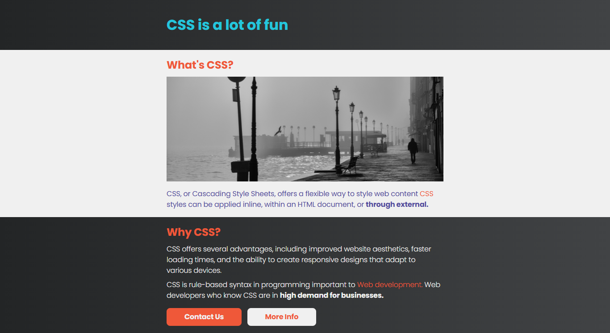
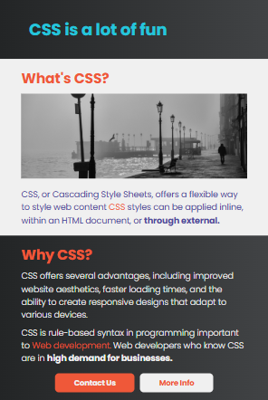

#  📄 CSS Vibes - A Simple CSS Blog  

CSS Vibes is a minimalist one-page blog built using HTML and CSS. It highlights the beauty of CSS styling while maintaining a clean, responsive design. This project was created for fun and serves as a great example of how CSS can enhance web content.

## 🛰 Live Demo  
🔗 [View Project](https://bhavikthakur.github.io/css-blog-dummy/)  

## 📸 Preview  
  
   

## 📌 Features  
✔️ 🎨 Clean & Modern Design – Aesthetic styling using CSS. <br>
✔️ 📱 Fully Responsive – Optimized for desktop, tablet, and mobile screens. <br>
✔️ 🚀 Fast & Lightweight – Simple HTML & CSS with no external frameworks. <br>
✔️ 🔗 Useful Links – External resources for learning more about CSS. <br>

## 🛠️ Built With  
- **HTML5**   <br>
- **CSS3**   <br>
- **Google Fonts (Poppins)**    <br>
- **CSS  Media Queries** 

## 📂 Folder Structure  
/project-folder <br>
│── /css <br>
│   ├── reset.css        # Resets default browser styles <br>
│   ├── styles.css       # Main styling file <br>
│   ├── media-queries.css # Responsive styles <br>
│── /images             # Contains all images & icons <br>
│── index.html          # Main HTML file <br>
│── README.md           # Documentation <br>


## 🔧 Setup & Usage  
1. Clone this repository:  
   ```bash
   git clone https://github.com/bhavikthakur/css-blog-dummy.git   
2. Open index.html in your browser. 


## 🤝 Connect With Me  
👨‍💻 GitHub: [bhavikthakur](https://github.com/bhavikthakur)  <br>
💼 LinkedIn: [Bhavik Thakur](https://www.linkedin.com/in/bhavik-thakur/)  <br>
🐦 Twitter: [Bhavik Thakur](https://x.com/BhavikkThakur)  <br>
